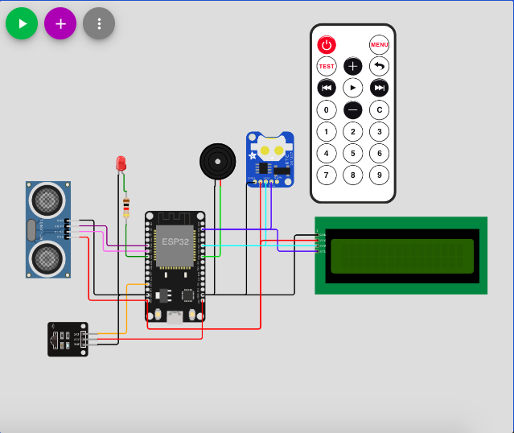

<h1 align="center">IoT Study and Sleep Monitoring</h1>
<h2>Overview</h2>

 This project is about a device that can be use as a bedtime alarm and counting time spent in studying. The user must first set the bedtime alarm with an infrared remote and it will be saved in the device. The alarm will rang at the bedtime, and the user will be able to stop it. It is assumed that the time the user stops the alarm is the time the user start sleeping, so the device will calculate the interval between the bedtime alarm and the time the user stop the alarm in order to find how late the user sleep. In addition, the device will also be able to count the time user spent in studying by detecting the presence of user in their study table and counting the time user sit there assuming sitting there means studying. Those data will be sent into Thingspeak.com and will be displayed as a graph and the user will be able to evaluate their sleep lateness and study time by seeing it in the app.

<h2>Navigation</h2>
<ul>
  <li><a href="#Overview">Overview</a></li>
  <li><a href="#IoT-Components">IoT Components</a></li>
  <li><a href="#Pinout-Table">Pinout Table</a></li>
  <li><a href="#Circuit-Design">Circuit Design</a></li>
  <li><a href="#How-Does-it-Works">How Does it Works?</a></li>
</ul>

<h2>IoT Components</h2>

The component used in the circuit will be divided into three category, namely the microcontroller, sensor, and actuator: 

<h3>Microcontroller</h3>
<ul>
  <li>ESP32</li>
</ul>
<h3>Sensors</h3>
<ul>
  <li>Ultrasonic sensor</li>
  <li>Real Time Clock (RTC module)</li>
  <li>Infrared receiver and infrared remote</li>
</ul>
<h3>Actuators</h3>
<ul>
  <li>Liquid Crystal Display I2C(16x4)</li>
  <li>Red LED</li>
  <li>Buzzer</li>
</ul>

<h2>Pinout Table</h2>
<h4>ESP32 to Ultrasonic Sensor</h4>
<table>
  <tr>
    <th>ESP32</th>
    <th>Ultrasonic Sensor</th>
  </tr>
  <tr>
    <th>D35</th>
    <th>ECHO</th>
  </tr>
  <tr>
    <th>D32</th>
    <th>TRIG</th>
  </tr>
  <tr>
    <th>GND</th>
    <th>GND</th>
  </tr>
  <tr>
    <th>VCC</th>
    <th>5V</th>
  </tr>
</table>
  
<h4>ESP32 to LED</h4>
<table>
  <tr>
    <th>ESP32</th>
    <th>Red LED</th>
  </tr>
  <tr>
    <td>D33</td>
    <td>Anode</td>
  </tr>
  <tr>
    <td>GND</td>
    <td>Cathode</td>
  </tr>
</table>
  
<h4>ESP32 to IR Receiver</h4>
<table>
  <tr>
    <th>ESP32</th>
    <th>IR Receiver</th>
  </tr>
  <tr>
    <td>D12</td>
    <td>DAT</td>
  </tr>
  <tr>
    <td>GND</td>
    <td>GND</td>
  </tr>
  <tr>
    <td>VCC</td>
    <td>3.3V</td>
  </tr>
</table>

<h4>ESP32 to Buzzer</h4>
<table>
  <tr>
    <th>ESP32</th>
    <th>Buzzer</th>
  </tr>
  <tr>
    <td>D18</td>
    <td>2</td>
  </tr>
  <tr>
    <td>GND</td>
    <td>GND</td>
  </tr>
</table>

<h4>ESP32 to LCD I2C (16x4)</h4>
<table>
  <tr>
    <th>ESP32</th>
    <th>LCD I2C</th>
  </tr>
  <tr>
    <td>D21 (SDA)</td>
    <td>SDA</td>
  </tr>
  <tr>
    <td>D22 (SCL)</td>
    <td>SCL</td>
  </tr>
  <tr>
    <td>VCC</td>
    <td>5V</td>
  </tr>
  <tr>
    <td>GND</td>
    <td>GND</td>
  </tr>
</table>

<h4>ESP32 to RTC Module</h4>
<table>
  <tr>
    <th>ESP32</th>
    <th>RTC Module</th>
  </tr>
  <tr>
    <td>D21 (SDA)</td>
    <td>SDA</td>
  </tr>
  <tr>
    <td>D22 (SCL)</td>
    <td>SCL</td>
  </tr>
  <tr>
    <td>VCC</td>
    <td>5V</td>
  </tr>
  <tr>
    <td>GND</td>
    <td>GND</td>
  </tr>
  <tr>
    <td>-</td>
    <td>SQW</td>
  </tr>
</table>
  
<h2>Circuit Design</h2>

<h2>How Does it Works?</h2>

 First, the microcontroller, which is ESP32, will setup and initiate all components, such as sensors and actuators, connected to it. Using LCD, it will prompt user to input their bedtime alarm in the format of hour and minute, check the validity of time, and saves it in a variable. The input will be done with IR remote and the IR receiver, which will detect the button pressed by the user. After that, the ESP32 will constantly compare the current time supplied by RTC module with the bedtime alarm. If the current time is the same as the bedtime alarm, the ESP32 will ring the buzzer and start counting time interval. The user will be able to stop the buzzer by pressing the power off button and then the ESP32 will stop counting time and it will send that time to ThingSpeak using HTTP. The ThingSpeak will display that data as a graph. At the same time, ESP32 will constantly check the presence of user at their study table with the ultrasonic sensor. If there is an object within the 30 centimeter, the ESP32 will turn on the study light and start to count time. If the object move away from the study table, the ESP32 will stop recording time and send it to ThingSpeak to be displayed as graph. The user will finally be able to check those data from the application that embed those graph.

<h2>TODO</h2>

Create android app version

